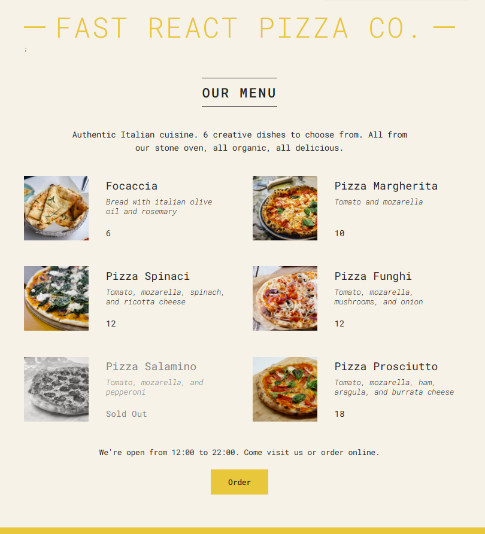

# 🍕 Fast React Pizza Co.

A simple React application that showcases a pizza restaurant menu with dynamic rendering of available and sold-out items. Built to practice core React concepts such as components, props, conditional rendering, and dynamic lists.

---
## Features

- **Dynamic Menu**: Displays a list of pizzas with images, ingredients, and prices.
- **Sold-Out Handling**: Sold-out pizzas are styled differently and marked clearly.
- **Restaurant Hours**: Footer dynamically checks the current time to display if the restaurant is open or closed.
- **Image Support**: Each pizza entry includes an image for a more realistic menu experience.
- **React Concepts Practiced**:
    - Functional components
    - Props and props destructuring
    - Conditional rendering
    - Rendering lists with `.map()`


---
##  Preview
[demo](https://fast-pizza-menue.netlify.app/)



---

## Tech Stack

- **React 18**
- JavaScript
- **Webpack** (for bundling and handling styles)
- **CSS** (basic styling)

---
## ▶️ Getting Started

1. Clone the repository:

2. Install dependencies:
    ```bash
    npm install
    ```

3. Start development server:
    ```bash
    npm start
    ```

4. Open in your browser:
    ```
    http://localhost:3000
    ```
