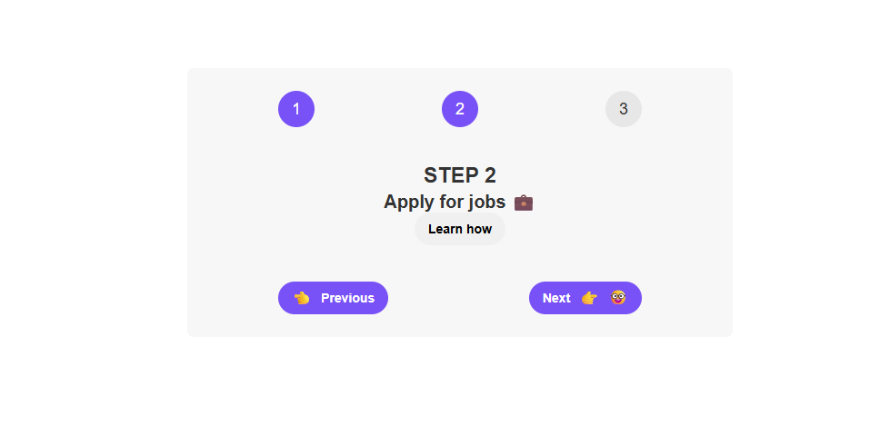

# Steps

This app demonstrates managing **component state**, **conditional rendering**, and **reusable components** in React.

---
## Features

- Step-by-step progress indicator (3 steps).
- Navigate **Next** 👉 and **Previous** 👈 between steps.
- Highlight the **active step number**.
- Each step shows a message with a **"Learn how"** button (displays an alert).
- Toggle to show/hide the entire steps component.
- Reusable `Button` and `Number` components.

---
## Tech Stack
- **React** (`useState` hook for state management)
- **CSS** (basic styling for steps and buttons)

---
## Preview

[demo](https://steps1.netlify.app/)

---
## Learning Objectives

- Understand **state management with `useState`**.
- Practice **component composition** and **props**.
- Implement **conditional rendering** in React.
- Build **reusable UI components** (Buttons, Numbers).
