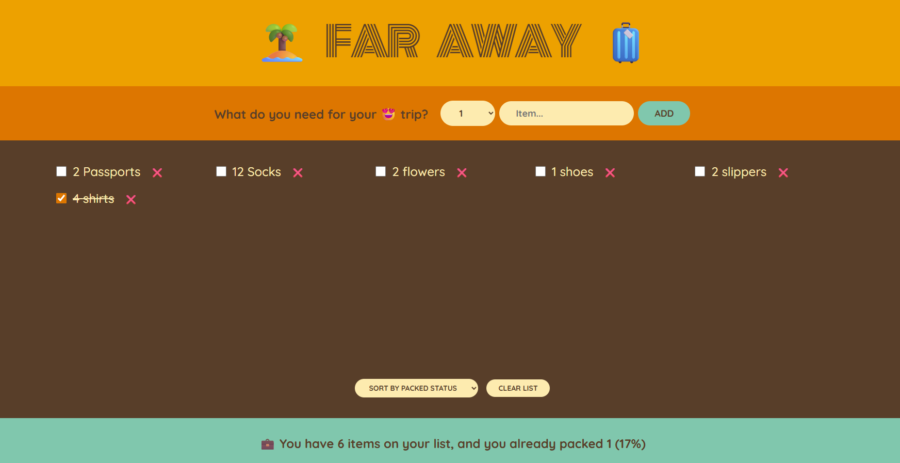

# Travel List App

The Travel List app is simple packing list manager to keep track of items for your next trip, showcasing React **state management**, **forms**, **lists**, and **component composition**.

---

## Features

-  **Add new items** with quantity selection.
-  **Toggle packed status** with a checkbox.
-  **Delete individual items** or **clear all items** with confirmation.
-  **Sort items** by input order, description, or packed status.
-  **Live stats** showing total items, packed items, and completion percentage.
-  Smart messages when you pack everything or have no items yet.

---
## 🛠️ Tech Stack

- **React** (Hooks: `useState`)
- `javascript`
- `jsx`
- **CSS** (Basic styling for layout and list items)

---
## Preview
[demo](https://travel-lis.netlify.app/)

---
## Learning Objectives

- Practice **form handling** in React.
- Work with **controlled components** for inputs and select elements.
- Manage complex **array state** and perform immutable updates.
- Implement **dynamic rendering** and conditional UI messages.
- Learn **sorting lists** based on different criteria.
