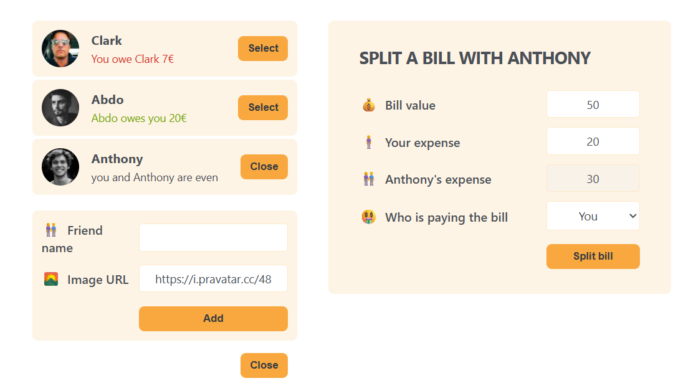

# Eat-n-Split

Eat-n-split app helps you **split bills with friends**, **track balances**, and **add friends dynamically**, showcasing React **state management**, **forms**, and **conditional rendering**.

---
## Features

- **Track balances** with each friend (who owes who).
- **Add new friends** with custom avatars.
- **Select a friend** to open a **split bill form**.
- **Split bills dynamically** based on who paid.
- Automatically **updates balances** for each friend.
- Close/open forms easily to manage UI state.

---
## Tech Stack
- **React** (Hooks: `useState`)
- **CSS** (Basic styling for layout, forms, and lists)
---
## Preview
[demo](https://eat-n-split-rabea.netlify.app/)

---
## How It Works

1. **Add Friends:** Enter a name and optional image URL.
2. **Select a Friend:** Click “Select” to open the bill-splitting form.
3. **Split a Bill:** Enter total bill and your expense. Choose who paid.
4. **Track Balances:** App calculates and updates who owes who.

---

## Key React Concepts

- **State Management:** `useState` for friends, forms, and selected friend ID.
- **Derived State:** Automatically shows correct messages based on balances.
- **Controlled Components:** Inputs and selects tied to component state.
- **Component Composition:**
    - `FreindsList` → Shows all friends.
    - `SplitBillForm` → Handles bill logic.
    - `AddFreindForm` → Adds new friends dynamically.

---
## Learning Objectives
- Build a **multi-component React app** with dynamic UI.
- Practice **lifting state up** and passing props between components.
- Implement **conditional rendering** to toggle forms and selections.
- Work with **derived state** for smarter calculations.
