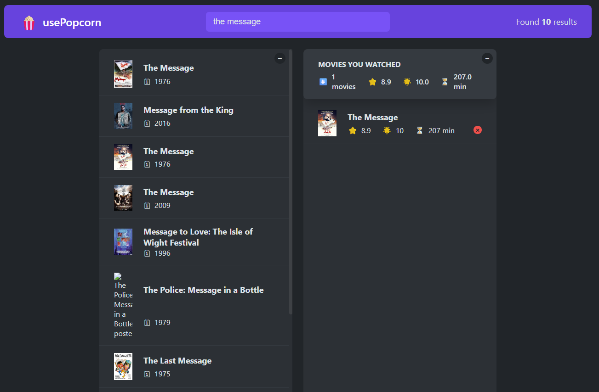

# UsePopcorn App

The **UsePopcorn App** is a React-based movie search and watchlist application built as part of the _Ultimate React Course_. It provides a hands-on demonstration of modern React development patterns, best practices, and hooks to manage state, side effects, and component composition.

---
## Overview

This project focuses on building a clean, modular React application to search movies using the OMDb API, manage a watchlist, and store user data in the browser’s local storage. It emphasizes **component design principles** and **reusable architecture**, showcasing techniques to manage state effectively and improve code scalability.

---

## Key Learnings

1. Splitting the UI into **small, reusable components** for maintainability.
2. Understanding and implementing **presentational**, **stateful**, and **structural** components.
3. Identifying and addressing the **prop drilling problem**.
4. Applying **component composition** to:
    - Build highly reusable components.
    - Solve prop drilling issues.
    - Make the app’s structure visually clear from the top-level component.
5. Leveraging **composition patterns** for layout organization, modals, and other reusable elements.
6. Using `useEffect` to:
    - Fetch data on component mount (OMDb API).
    - Synchronize app state with external APIs , the DOM (e.g., updating the document title).
    - React dynamically to state and prop changes.
7. Storing and retrieving data from **local storage** for persistent watchlists.
8. Initializing state using **callback functions** to efficiently read from local storage.
9. Using `useRef` to:
    - Manipulate the DOM in a React-friendly way.
    - Store mutable values between renders without triggering re-renders.
10. Creating **custom hooks** to extract and reuse logic across components.
11. Using `useCallback` to memoize functions, preventing unnecessary re-executions of `useEffect` on re-renders.

---
## Demo
[demo](https://usepopcorn-rabea.netlify.app/)

- - - -  
## Tech Stack

- **React** (Hooks: `useState`, `useEffect`, `useRef`, `useCallback`)
- **OMDb API** for fetching movie data
- **Local Storage** for watchlist persistence
- **CSS** for styling

---

## Features

- Search for movies using the OMDb API.
- Add, view, and manage a personalized watchlist.
- Persist data across sessions using local storage.
- Interactive UI with reusable layout and modal components.
- Dynamic updates to the document title based on the app’s state.
- Optimized rendering using memoization and refs.

---

## Learning Outcomes

This project demonstrates how to:
- Design scalable React applications using **component composition**.
- Solve real-world React problems such as **prop drilling**.
- Build **custom hooks** to abstract repetitive logic.
- Manage **side effects**, **persistent state**, and **DOM interactions** effectively.
- Apply memoization (`useCallback`) for performance optimization.
