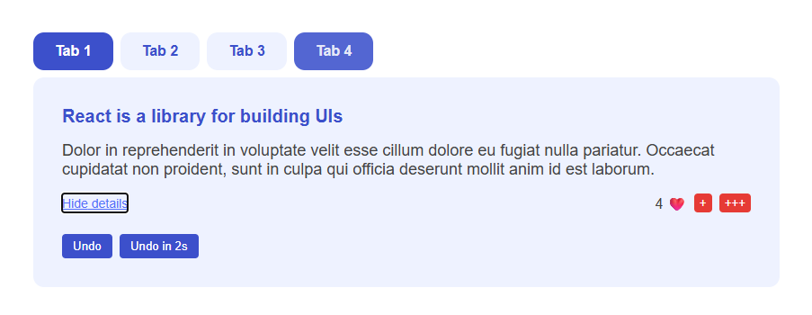

# How React Works

A React playground app built as part of **The Ultimate React Course by Jonas Schmedtmann**.  
This project demonstrates key React concepts, including **state batching**, **keys**, **event handling**, **state reset**, and more, through a simple **tabbed interface**.

---
## Features

- **Tabbed UI** with 4 tabs:
    - Tabs 1–3 show educational content with interactive controls.
    - Tab 4 demonstrates **state reset** when switching between entirely different UI.
- ❤️ **Like counter** with single and triple increment buttons to explore **state updates and batching**.
- Toggle **show/hide content** dynamically.   
- **Undo buttons** (instant and delayed) to test **React’s batching behavior** in asynchronous code (e.g., `setTimeout`).
- **Key prop exploration**: Switching tabs resets the content’s internal state due to unique `key` usage.

---

## Tech Stack

- **React 18+** (Hooks: `useState`)
- **CSS** for simple styling and tabbed UI design

---

## Key Learnings

- Key Prop: How using unique keys causes React to **reset component state** when the same component re-render in the same location
- state batching: how react batches the states' update inside event handle function, setTimeout and more to avoid wasted renders.
- Event Handling: Writing clean handler functions and managing side effects.
- State Reset: Switching tabs with different components demonstrates state isolation.

---
## Preview

[demo](https://how-react-works-rabea.netlify.app/)

