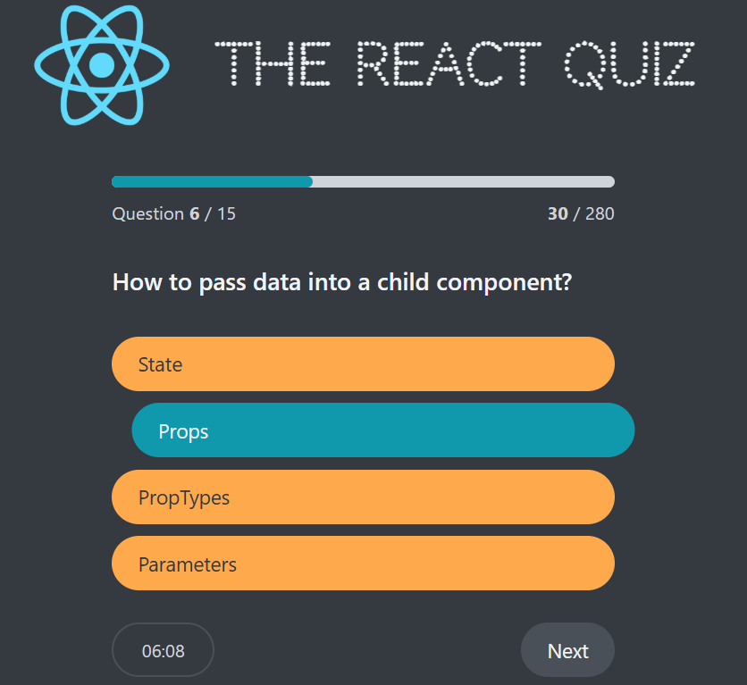

# React Quiz App

The **React Quiz App** is a learning project built as part of the _Ultimate React Course_. It demonstrates how to structure and manage application state in React using the **`useReducer` hook**, and how to simulate backend interactions using **json-server** as a fake REST API.

---
## Overview

This app allows users to take quizzes with questions fetched from a fake server. It showcases how to replace complex `useState` logic with `useReducer` for predictable state transitions, as well as how to set up and consume data from a local development server using **json-server**.

---
## Demo

[demo](https://react-quiz-rabea.netlify.app/)

---
## Key Learnings

1. **`useReducer` hook** for managing complex state:
    - Handling multiple state transitions in a predictable, centralized way.
    - Organizing state logic using reducer functions and action types.
    - Avoiding deeply nested or scattered `useState` calls.
    
2. **Fake server with `json-server`**:
    - Simulating a backend by serving quiz questions from a local JSON file.
    - Practicing API requests and data fetching in React.
    - Building apps with a real-world client–server workflow without needing an actual backend.

---
## Tech Stack
- **React** (`useReducer`, `useEffect`)
- **json-server** (for serving quiz questions)
- **CSS** (basic styling)

---
## Features

- Fetch quiz questions from a fake server (`json-server`).
- Display multiple-choice questions with selectable answers.
- Manage quiz flow (start, next question, finish) using `useReducer`.
- Show results at the end of the quiz.
- Simple, structured state management with clear reducer actions.
- Count down timer to finish the quiz when time elapsed
