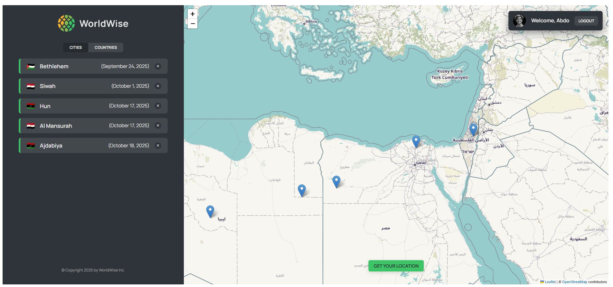

# WorldWise App

The **WorldWise App** is a location-based React application built to explore the world interactively. It allows users to log in, select cities on a map, and record their travel experiences. This project demonstrates advanced concepts in **React Router**, **Context API**, **state management**, and **performance optimization** through **code splitting**.

---
## Overview

WorldWise is designed as a **Single Page Application (SPA)** powered by **React Router**. It integrates authentication, dynamic routing, and real-time form interactions. The project showcases a clean, modular architecture and emphasizes optimizing React apps for scalability and maintainability.

---
## Key Learnings

### 1. Building SPAs with React Router

- Configured **client-side routing** to enable navigation without full page reloads.
- Utilized **dynamic route parameters (`params`)** and **search queries (`searchParams`)** to control component rendering and URL state.
    - Changing query parameters automatically triggers a **component re-render**, keeping UI and URL synchronized.

---
### 2. Styling with CSS Modules

- Adopted **CSS Modules** for scoped and maintainable styling.
- Prevented naming collisions and improved component encapsulation.

---
### 3. Global State with Context API
- Implemented a **Cities Context** to manage city data globally.
- Provided clean, independent, and reusable components with no prop drilling.
- Handled city operations such as fetching, adding, and updating directly through the context provider.

---
### 4. City Form Functionality
Built a complete data entry workflow using controlled components and React state:
- Populated form data dynamically when a user clicks on a map location.
- Automatically fetched **country information** via an external API.
- Managed form state and submission using standard React patterns.

---
### 5. Authentication System
Developed a secure and scalable authentication flow using:
- **Context + Reducer** pattern to manage user and authentication states.
- **Login** and **Logout** functionalities to update state consistently across the app.
- **Protected routes** to restrict access to authenticated users only.

---
### 6. Performance Optimization
#### a. Memoizing Functions - Components and values
- Used **`useCallback()`** to memoize functions such as `getCity`, preventing unnecessary re-renders and infinite effect loops.
- Avoided repeated recreation of functions that are part of dependency arrays in `useEffect`.

#### b. Code Splitting
- Applied **React.lazy()** and **Suspense** for **bundle optimization**, loading only the required parts of the app when needed.
- Improved initial load performance and user experience by showing fallback UIs during component loading.

---
## Tech Stack

- **React** (`react-router-dom`, `useReducer`, `useCallback`, `useContext`, `lazy`, `Suspense`)
- **CSS Modules** for scoped component styling
- **JavaScript (ES6+)**
- **External API Integration** for fetching country data
- React Leaflet map

---
## Project Highlights

- Built a **SPA** with dynamic and protected routes.
- Integrated **map-based city selection** and **form submission** workflows.
- Applied **Context API** for global state management with cleaner data flow.
- Designed **authentication and route protection** using reducer-based state management.
- Improved performance through **memoization** and **code splitting**.

## Demo

[Live Demo](https://worldwise-rabea.netlify.app/)

---
## Learning Outcomes

By completing this project, you will learn how to:
- Build **Single Page Applications** using React Router.
- Use **Context API** and **reducers** for scalable state management.
- Implement **authentication systems** with route protection.
- Manage side effects and data synchronization using **React hooks**.
- Apply **performance optimization** techniques such as memoization and lazy loading.
- Write **modular, maintainable, and reusable React components**.
