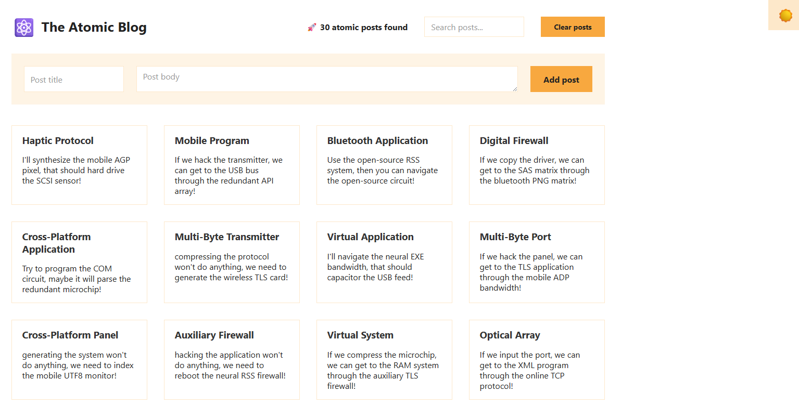

# Atomic Blog App

The **Atomic Blog App** is an optimized React application built as part of the _Ultimate React Course_. It demonstrates how to analyze, refactor, and enhance an existing application using the **Context API**, **memoization**, and **component composition** to achieve cleaner architecture and improved performance.

---
## Overview

This project focuses on **state management**, **performance optimization**, and **component design** in React. It showcases how the **Context API** simplifies data flow across deeply nested components and how memoization techniques reduce unnecessary re-renders to keep the UI efficient.

---
## demo
[live demo](https://atomic-blog-rabea.netlify.app/)




- - - - 

## Key Learnings

### 1. Application Analysis

- Understanding and breaking down an existing React app to identify redundant re-renders and inefficient data flow.
### 2. Context API Usage and Benefits

- Replacing **prop drilling** with a **centralized context** for state management.
- Making components:
    - **Clean** – with no dependencies on parent props.
    - **Independent and reusable** – any component can consume context values directly without relying on its parent’s data flow.

**Steps to use the Context API:**
1. **Create the context:**
    ```js
    const PostContext = createContext();
    ```
2. **Provide the context values:**
    ```jsx
    <PostContext.Provider value={{ posts, addPost }}>
      {children}
    </PostContext.Provider>
    ```
3. **Consume the context in any component:**
    ```js
    const { posts } = useContext(PostContext);
    ```

---
### 3. Avoiding Wasted Renders

**Wasted renders** are re-renders that do not affect the UI. This project focuses on minimizing them using:

1. **Component Composition**
    - Passing components as `children` to allow React to control when and how they are rendered.
    - Makes layout more declarative and improves rendering control.
2. **Memoizing Components**
    - Using `React.memo()` to prevent re-renders when props have not changed.
    - Note: Memoization only tracks **props**, not context or internal state changes.
    ```js
    export default memo(PostList);
    ```
    
3. **Memoizing Values and Functions**
    - Using `useMemo()` to cache expensive values.
    - Using `useCallback()` to memoize functions passed as props, avoiding unnecessary re-renders in children.
    
    ```js
    const filteredPosts = useMemo(() => filterPosts(posts), [posts]);
    const handleLike = useCallback(() => setLikes((l) => l + 1), []);
    ```
    
1. **Optimizing Context Value**
    - Memoizing the **value object** passed to the context provider to prevent re-renders of all consumers when the parent re-renders:
    
    ```js
    const value = useMemo(() => ({ posts, addPost }), [posts]);
    <PostContext.Provider value={value}>{children}</PostContext.Provider>;
    ```

---

## Tech Stack

- **React** (`useContext`, `useMemo`, `useCallback`, `memo`)
- **JavaScript (ES6+)**
- **CSS** for styling

---
## Project Highlights
- Efficient global state sharing using **Context API**.
- Highly **modular and composable component structure**.
- Performance-optimized rendering with **React.memo**, **useMemo**, and **useCallback**.
- Demonstrates the importance of avoiding **wasted renders**.

---

## Learning Outcomes

By building and optimizing this app, you will learn how to:
- Use the **Context API** effectively for global state management.
- Avoid prop drilling while maintaining clean, modular code.
- Optimize React apps for performance by reducing unnecessary renders.
- Apply **memoization techniques** to both components and data.
- Build **independent, reusable, and predictable components**.