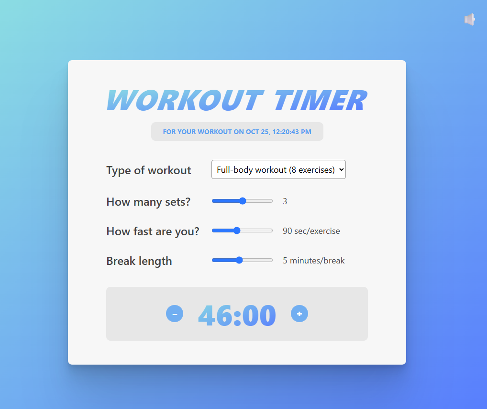

# Workout Timer App

The **Workout Timer App** is a React-based application designed to help users manage and track workout sessions efficiently. It provides a clean and interactive interface for timing exercises while demonstrating advanced concepts in React performance optimization and effect management.

This project emphasizes **React hooks**, **memoization**, and **side-effect handling**, offering valuable insights into how to write performant and maintainable React applications.

*This project is a step in the learning process of react*

---
## Overview

This app manages workout sessions through well-structured React components that interact seamlessly via state and effects. It demonstrates how to use React’s core tools—`useState`, `useEffect`, `useCallback`, and `memo`—to handle UI updates efficiently, synchronize with external APIs, and reduce unnecessary re-renders.

---
## Key Learnings

### 1. Memoization with `memo` and `useCallback`

- Practiced optimizing performance by **memoizing components** with `React.memo()` to prevent unnecessary re-renders.
- Used **`useCallback()`** to memoize functions passed as props, ensuring that child components only re-render when needed.
- Learned how memoization contributes to predictable rendering and smoother user interactions.

---
### 2. State Synchronization with `useEffect`

- Applied **`useEffect()`** to update state when it depends on other states, centralizing update logic instead of spreading it across multiple handlers.
- Understood that while this approach adds an extra render cycle, it improves clarity and maintainability by keeping related logic in one place.

---
### 3. Side Effects and External APIs
- Connected **local component states** with **external effects** such as the browser tab title.
- Automatically updated the **document title** whenever the number of exercises changed, showing how to integrate the app state with the browser environment.

---
## Additional Learning Outcomes

Although these are only part of the overall lessons from the project, additional takeaways include:
- Building a responsive and modular component structure.
- Managing UI timing behavior through controlled component state.
- Understanding when and how to separate logic for readability versus performance.
- Gaining deeper insight into **how React renders**, and how to control that rendering process efficiently.
---
## Demo
[Live Demo](https://workout-timer-rabea.netlify.app/)

---
## Tech Stack

- **React** (`useState`, `useEffect`, `useCallback`, `memo`)
- **JavaScript (ES6+)**
- CSS

---
## Learning Outcomes Summary
Through building the Workout Timer App, you will:
- Learn how to **optimize React apps** using memoization and function caching.
- Understand **side effects** and how to synchronize them with state changes.
- Practice managing complex state dependencies using `useEffect`.
- Gain experience in writing **clean, maintainable React components** that balance performance and readability.
