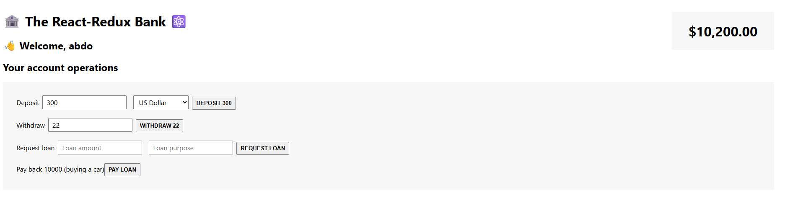

# The React Redux Bank

A simple banking app built to learn **state management with Redux** — from classic Redux setup to modern React-Redux integration and asynchronous logic using **Redux Thunk** and **Redux Toolkit (RTK)**.

---
## Overview

This project simulates basic banking operations like deposits, withdrawals, and currency conversions, while focusing on understanding **Redux from the ground up** — building reducers, combining them, dispatching actions, and integrating them into React components.

---
## Demo
[Live demo](https://rabea-redux-bank.netlify.app/)


- - - 
## Key Learnings
### Redux Fundamentals
- Learned how to **write Redux code standalone** (without React).
- Created **multiple reducers** and **action creators** for different features.
- **Combined reducers** into a single **root reducer** to manage complex state trees.
- **Tested** the logic by dispatching actions manually and observing state changes.
- Tested the logic using redux-devtools
### React Integration (React-Redux)

- Connected Redux with React using the **Provider** component — similar to Context API with reducers.
- Consumed state inside components using the **useSelector** hook.
- Accessed the **dispatch** function using **useDispatch**, enabling components to trigger actions.
- Understood that:
    - `react-redux` organizes and optimizes state consumption.
    - `redux` itself handles the dispatching and updating of state.

### Asynchronous Logic with Thunk
- Used **Redux Thunk middleware** to handle asynchronous operations such as fetching or converting data.
- Learned the flow:
    1. Action dispatched → goes to middleware (not directly to reducer yet).
    2. Middleware performs async work (e.g., currency conversion).
    3. Once data is ready → dispatches another action with the result to the reducer.
- Example:  
    Dispatching a “deposit” action after converting the entered amount into USD.
- Configured middleware with:
    ```js
    const store = createStore(rootReducer, applyMiddleware(thunk));
    ```
- This pattern keeps **components clean** — no async code inside them, all side effects are handled centrally.

### Redux Toolkit (RTK)
- Explored **Redux Toolkit** as a modern, concise way to write Redux logic.
- Learned that RTK is **fully compatible** with Redux + middleware while simplifying syntax and reducing boilerplate.

---
## Tech Stack
- **React**
- **Redux** 
- **React-Redux**
- **Redux Thunk**
- **Redux Toolkit**
- **HTML - CSS - JS**

---
## What I Learned

This project helped me:
- Build Redux from scratch and understand its internal flow.
- Organize and scale global state with multiple reducers.
- Connect Redux cleanly with React using React-Redux hooks.
- Manage async operations effectively with middleware.
- Appreciate how **Redux Toolkit** improves the developer experience.
