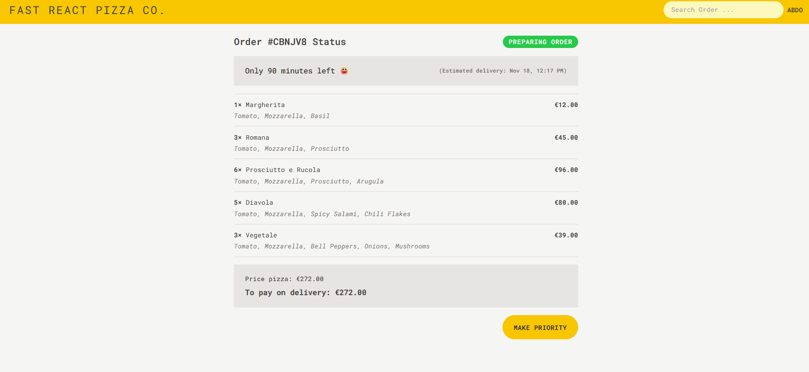

# 🍕 Fast React Pizza Co.

A modern pizza ordering SPA built with **React + TypeScript**, featuring a professional architecture, data-driven routing, TailwindCSS styling, and global state management with Redux Toolkit.

---
## What I Learned

### React + TypeScript
- Introduced TypeScript into a real project.
- Strong typing for components, props, and utilities.
### Feature-Based Architecture
- Organized the codebase by _features_, not file types.
- Easier scalability and cleaner separation of concerns.
### App Layout System
- Built an `AppLayout` that renders persistent UI sections.
- Child routes displayed using `<Outlet />`.
### Data Loading with React Router
- Transitioned from **fetch on render** to **fetch as render** using:
    - **Loaders** for data fetching
    - **Actions** for mutations
    - `useLoaderData()` for consuming fetched data
### Error & Navigation State Handling
- Global navigation state via `useNavigation()`
- Error boundaries using `errorElement` + `useRouteError()`
### Server Mutations with React Router `<Form>`
- React Router intercepts form submissions and calls an `action()`
- Supports validation via `useActionData()`
- Automatic revalidation after mutations
###  TailwindCSS Styling
- Utility-first styling for rapid development
- Mobile-first responsive design
- Custom theme extensions
### Global State with Redux Toolkit
- Managed UI state with RTK slices
- Handled async remote state using Redux Thunks
### React Router Fetcher
- Fetch or submit data **without navigation**
- Triggers automatic route revalidation

---

## Demo

[live demo](https://rabea-fast-react-pizza.netlify.app/)


- - - - 
## Tech Stack

- **React + TypeScript**
- **React Router v6.4+** (Loaders, Actions, Fetchers)
- **TailwindCSS**
- **Redux Toolkit + Thunks**

---
## Running the Project

```bash
npm install
npm run dev
```

---
