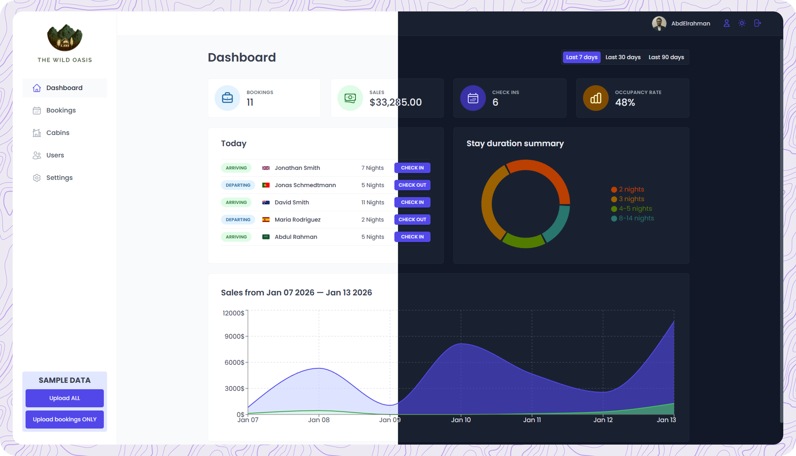

# The Wild Oasis 🌴

The Wild Oasis app is a full-stack hotel management web application built with **React** and **Supabase**.  
The project focuses on building a **real-world, production-ready React application** using modern architectural patterns, reusable components, and robust state management.
This application was developed as part of  
**_The Ultimate React Course 2025: React, Next.js, Redux & More_** course
by **Jonas Schmedtmann** (Udemy).

---

## Live Demo

[Live Demo link](https://the-wild-oasis-rabea.vercel.app/)

---

## 🛠 Tech Stack

### Frontend

- **React+TS**
- **React Router** – SPA routing
- **Styled Components** – component-scoped styling
- **React Query** – server state management
- **Context API** – UI state management
- **React Hook Form** – form handling & validation

### Backend & Services

- **Supabase** – authentication, database, API

### Visualization & Utilities

- **Recharts** – charts & analytics
- **React Icons**
- **React Hot Toast**
- **Date-Fns**
- **React Error Boundary**

---

## Features

### Authentication & Authorization

- Secure login and logout
- User sign-up with **email verification**
- Role-based access control
- Session persistence

### Cabins & Bookings Management

- Create, edit, duplicate, and delete cabins
- Highly reusable **context menu** integrated with modals
- Client-side and server-side filtering & sorting
- URL-based state for shareable filters

### Dashboard & Analytics

- Interactive charts and statistics
- Booking trends and occupancy insights
- Quick actions for common workflows
- Built using **Recharts**

### UI & UX

- Elegant sidebar navigation
- Dark mode using **design tokens**
- Theme preference stored in `localStorage`
- Toast notifications for user feedback

### Error Handling

- Global **Error Boundary** implementation
- Graceful handling of React render errors

---

## What I Learned

This project was a deep dive into **advanced React engineering practices**, including:

### React Architecture & Patterns

- **Render Props Pattern**
- **Higher-Order Components (HOC)**
- **Compound Component Pattern**
- Building highly reusable and composable UI components

### Advanced Component Implementations

- Reusable modal system using **React Portal**
- Handling outside clicks using **capture & bubbling phases**
- Custom reusable tables with render props
- Context-driven UI state management

### State Management

- **React Query** for remote server state
- **Context API** for global UI state
- URL-synced filtering and sorting

### Forms & Validation

- Form handling with **react-hook-form**
- Schema-based validation
- Controlled and uncontrolled form patterns

### Full-Stack Development

- Supabase as:
  - Authentication provider
  - Database
  - Backend API
- Server-side filtering and sorting
- Secure data access

---

## Styling Approaches Explored

- CSS Modules
- Tailwind CSS
- Styled Components (primary approach in this project)

---

## License

This project is for **educational purposes** and follows the course guidelines.
